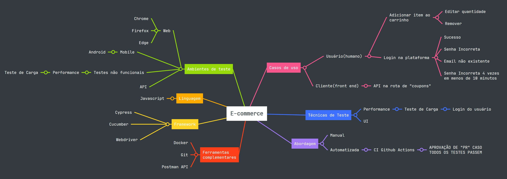
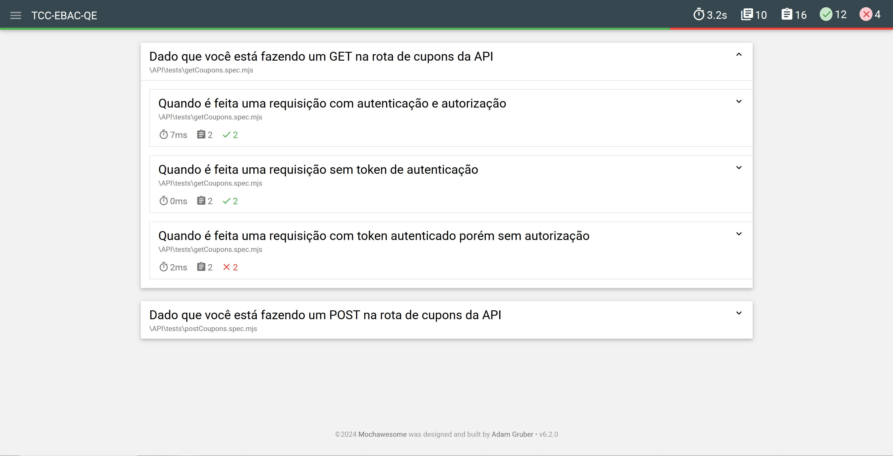
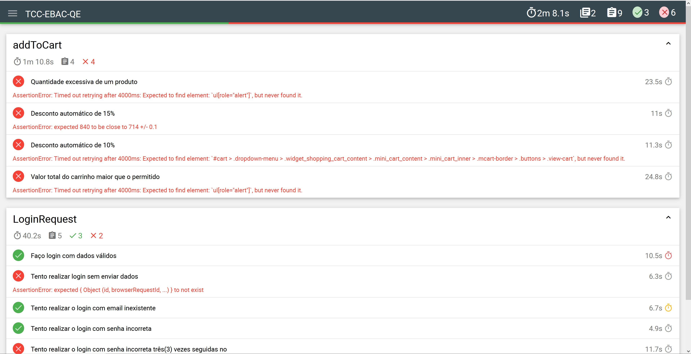

# 🌟💻 TCC-EBAC-QE 💻🌟

Projeto que verifica a Qualidade da aplicação EBAC STORE
envolvendo testes automatizados de UI, mobile e API.

---

## Índice

- [Visão Geral](#-visão-geral)
  - [Objetivo](#-objetivo)
  - [Ponto de partida](#-ponto-de-partida)
  - [Responsabilidade](#-responsabilidade)
  - [Público alvo](#-público-alvo)
  - [Estratégia de testes](#-Estratégia-de-testes)
  - [Histórias de Usuário](#-histórias-de-usuário)
  - [Casos de testes](#-casos-de-testes)
- [Tecnologias utilizadas](#-tecnologias-utilizadas)
- [Como executar o projeto](#-como-executar-o-projeto)
  - [Pré-requisitos](#-pré-requisitos)
  - [Requisitos](#-configuração-de-ambiente)
  - [Executar os manuais de API](#-Executar-os-manuais-de-API)
  - [Executar os automatizados de API](#-Executar-os-automatizados-de-API)
  - [Executar UI](#-executar-ui)
  - [Executar Mobile](#-executar-mobile)
  - [Executar o de performance](#-executar-o-de-performance)
- [Relatórios das baterias de testes](#-relatórios-das-baterias-de-testes)
  - [API](#-api)
  - [UI](#-ui)
  - [Mobile](#-mobile)
- [CI/CD Github Actions](#-cicd-github-actions)
- [Estrutura do projeto](#-estrutura-do-projeto)
  - [Arquitetura](#arquitetura)
  - [Scripts](#-scripts)
  - [Dependências](#dependências)
- [Processo de aprendizado](#-processo-de-aprendizado)
  - [Fluxo do projeto](#-fluxo-do-projeto)
  - [Bloqueios e dificuldades](#-bloqueios-e-dificuldades)
  - [Próximos passos](#-próximos-passos)
- [Créditos](#-créditos)
  - [Fontes](#-referências-bibliográficas)

<hr style="border-top: 3px solid #bbb;">

## 👁️ Visão Geral

### 🥅 Objetivo

Este projeto de estudos, o último projeto do curso de Qualidade de Software da EBAC, busca comprovar a qualidade da aplicação de Ecommerce `Ebac shop Loja de teste`.
Para fazer realizar isso são executadas baterias de testes dos tipos:

- versão mobile Android;
- Web no navegador Edge;
- API;
- Teste não funcional de Performance;

### 🎬 Ponto de partida

Três casos de testes detalhados presentes em [histórias de usuários](./docs/M34%20-%20historias_de_usuario.pdf).

### 🍳 Responsabilidade

Produzir testes no modelo BDD que possam ser executados de maneira automatizada através de CI/CD a partir de Casos de teste previamente definidos.

### 🎯 Público alvo

Trazer clareza ao time de desenvolvimento os pontos do projeto que possuem fragilidades. A fim de que uma experiência
de maior qualidade seja entregue ao usuário final

---

### 🗺️ Estratégia de testes



---

#### Escolha do framework UI

As Ferramentas consideradas para a realização dos testes de UI foram:

- [Cypress](https://www.cypress.io/)
- [WebdriverIO](https://webdriver.io/)
- [Playwright](https://playwright.dev/)

##### Cypress

➕ Pontos positivos:

- Facilidade de setup para se iniciar o projeto rápido;
- Documentação excelente;
- Possibilidade de alterar a resposta da API;

➖ Limitações:

- Só é possível testar em um browser por vez;
- Para fazer um set de CI/CD em Docker ele ocupa espaço grande em Disco;
- Necessidade de uso de “library” externa para compatibilizar com Cucumber;

##### WebDriverIO

➕ Pontos positivos:

- Usado tanto em aplicações web quanto em nativos(Android/iOS);
- Flexibilidade para integrar com diferentes Reporters e Integrações CI/CD(Jenkins, Azure etc);
- Dá suporte para requisição “cross-origin”;

➖ Limitações:

- Não há uma janela onde é possível ver o desenrolar do teste;
- Sintaxe verbosa comparado ao Cypress;
- Documentação não tão boa;

##### Playwright

➕ Pontos positivos:

- Pode ser escrito em várias linguagens(Java, C#, Javascript etc);
- Facilidade para executar testes em múltiplos browsers simultaneamente;
- Emulador nativo para mobile;

➖ Limitações:

- Não há uma janela onde é possível ver o desenrolar do teste;
- Suporte da comunidade por enquanto é pequeno;
- Não há feedback visual em tempo real como o Cypress;

##### Decisão:

Após o comparativo foi escolhido usar o Framework Cypress pela possibilidade de acompanhar um teste visualmente em tempo real. Junto dele foi setado o Cucumber para aplicar a metodologia BDD Gherkin diretamente nos testes.

Foram automatizados os fluxos de `adicionar produto ao Carrinho` e `Login`;

---

### 📜 Histórias de usuário

As histórias de usuário estão disponíveis no [PDF](./docs/M34%20-%20historias_de_usuario.pdf)

### 👨🏽‍🔬 Casos de testes

Independente do framework e do que era testado, em todos os testes foi priorizado o modelo BDD de que:

```js
  Dado {uma condição}
  Quando {eu executo uma ação}
  Então {o resultado é esse}
```

<hr style="border-top: 3px solid #bbb;">

## 📚 Tecnologias utilizadas

- [Cypress](https://docs.cypress.io/): É uma biblioteca de testes de interface de ponta a ponta;
- [Cucumber](https://cucumber.io/): Ferramenta utilizada em conjunto com o Cypress para executar testes na metodologia BDD(Behaviour Driven Development);
- [Supertest](https://www.npmjs.com/package/supertest): Biblioteca para efetuar testes na API;
- [Mocha](https://mochajs.org/): Framework de testes usado nos testes de API.
- [Chai](https://mochajs.org/): Usado para auxiliar os testes de Performace.
- [K6](https://k6.io/docs/): Este é o framework para testes de performance de API.
- [Grafana](https://grafana.com/): Plataforma para visualizar os testes de performance.
- [influxDB](https://www.influxdata.com/): Banco de dados para executar os testes de performance.
- [@faker-js/faker](https://fakerjs.dev/): Geração de dados para realizar testes sem repetição.
- [Postman API](https://fakerjs.dev/): Ferramenta de testes manuais na API.

<hr style="border-top: 3px solid #bbb;">

## 🚀 Como executar o projeto

### 🌎 Pré-requisitos

- Ter o `node` e o `pnpm` instalado localmente;
- Ter o `docker` instalado e rodando localmente;

Abra o terminal na pasta raiz do projeto.

Execute os seguintes comandos:

### 🌴 Configuração de Ambiente

```ssh
# 🏃🏽 Para ativar o servidor
docker network create --attachable ebac-network
docker run -d --name wp -p 80:80 --network ebac-network ernestosbarbosa/lojaebac:latest
```

> Isso irá iniciar o servidor em http://localhost:80.

```ssh
# 📥 Instale as dependências localmente
pnpm install
```

<hr style="border-top: 3px solid #bbb;">

## 👨🏽‍🔬 Execução das baterias de testes

### 🏃🏽 Executar os manuais de API

> Caso você tenha o Postman localmente, você pode usar o arquivo `./API/loja-ebac.postman_collection.json`
> e aplicá-lo manualmente.

### 🍱 Executar os automatizados de API

```ssh
pnpm test:api
```

### 🎦 Executar UI

> 👁️ Para rodar a bateria de testes de Interface visualizando o fluxo da UI em tempo real `pnpm cy:open`

#### 🧪 Para rodar a bateria de testes de Interface visualizando apenas o resultado no terminal

```ssh
pnpm cy:run
```

Ao fazer isso ocorrerá a atualização do relatório de testes presente em `./UI/mochawesome-report`

### ⚡ Executar o de performance

```ssh
# rode o docker compose:
docker-compose up
```

### 📱 Executar Mobile

> O setup para testes Mobile é bastante trabalhoso, se prepare.

É necessário você ter instalado em sua máquina:

- Appium
- Java
- Android Studio
- Criar um device dentro do Android Studio
- instalar o Appium Doctor através do comando: `npm -g @appium/doctor`

2. Instalar uiautomator2 driver rodando appium driver install uiautomator2 ;
3. Baixar appium-inspector; (comando adb not found);
4. Dentro do appium inspector setar as capabilities;
5. Rodar `java -jar ./Mobile/App/bundletool-all-1.16.0.jar install-apks --apks=./Mobile/App/ebacshop.apks`
6. abrir o emulator com "start session". Logo tem três coisas abertas, appium , emulator @nome-do-emulator , Appium Inspector com "start session" e appium doctor
7. No emulador aparecerá o aplicativo da EBAC.

<hr style="border-top: 3px solid #bbb;">

## 📝 Relatórios das baterias de testes

### 🍱 API



---

### 🎦 UI

- Caso algum teste falhe será gerado um print da UI no momento do erro em `./UI/cypress/screenshots`
- Há um resultado dessa bateria de testes em `./UI/mochawesome-report/result.html`.
  Você deve clicar no ícone de browser de sua preferência para visualizá-lo:
  

---

### ⚡ Performance

1. Abra o Grafana no localhost:4000
2. Clique em `Dashboard`
3. Clique em `Import Dashboard`
4. Onde está escrito `Find and import dashboards for common applications at ` você coloca `2587`
5. Em seguida nomeie o Dashboard como preferir, coloque o k6 como `k6influxdb` e aperte `Import`



---

### 📱 Mobile

> Caso você queira visualizar o report existente faça `pnpm allure open`.


<hr style="border-top: 3px solid #bbb;">

## 🧱 CI/CD Github Actions

Foi configurada uma ação no momento em que ocorre um deploy na branch `main`.

1. É configurado o Node 20 e é instalado o `pnpm` como gerenciador de dependências;
2. As dependências são instaladas;
3. É executada a bateria de testes de UI com Cypress;
4. É executada a bateria de testes de API com Supertest;

Para uma Pull Request(PR) ser aprovada estas duas baterias precisam ser executadas
com 100% de sucesso. Caso contrário ela é automaticamente rejeitada.

<hr style="border-top: 3px solid #bbb;">

## 🏗️ Estrutura do Projeto

### Arquitetura

- `.github/`: Contém a rotina que só autoriza o deploy na `main` caso todos
  os testes tenham sucesso;
- `API/`: Contém testes e configuração relacionados aos testes de API;
- `docs/`: Dispõe os arquivos macro relacionados ao projeto como a image da Estratégia do projeto;
- `Mobile/`: Contém testes e configuração relacionados aos testes Mobile;
- `performace/`: Contém testes e configuração relacionados aos testes Mobile;
- `UI/`: Contém testes e configuração relacionados aos testes de UI end-to-end;
- `.env`: Possui as variáveis de ambiente do projeto;
- `.gitignore`: Arquivos ignorados no versionamento do projeto pelo Git;
- `cypress.config.js`: Configura o Cypress UI;
- `docker-compose.yml`: Executa a rotina necessária para se produzir o teste de performance com visualização de relatório pelo Grafana;
- `package.json`: Central do projeto. Tem tudo;
- `grafana-dashboard.yaml`: Possibilita a visualização de relatórios de teste de performance através do Grafana;
- `grafana-datasource.yaml`: Cria um banco de dados com InfluxDB para possibilitar a execução de testes de Performance;

---

### Dependências

- `@badeball/cypress-cucumber-preprocessor`: `^20.1.0`
- `@cypress/webpack-preprocessor`: `^6.0.2`
- `@faker-js/faker`: `^8.4.1`
- `@wdio/globals`: `^8.39.1`
- `allure-commandline`: `^2.29.0`
- `allure-mocha`: `3.0.0-beta.7`
- `chai`: `^5.1.1`
- `chai-things`: `^0.2.0`
- `cypress`: `^13.13.1`
- `dotenv`: `^16.4.5`
- `k6`: `^0.0.0`
- `mocha`: `^10.6.0`
- `mochawesome`: `^7.1.3`
- `mochawesome-merge`: `^4.3.0`
- `mochawesome-report-generator`: `^6.2.0`
- `newman`: `^6.1.3`
- `newman-reporter-htmlextra`: `^1.23.1`
- `prettier`: `^3.3.3`
- `supertest`: `^7.0.0`
- `@wdio/allure-reporter`: `^8.39.0`
- `@wdio/appium-service`: `^8.39.1`
- `@wdio/cli`: `^8.39.1`
- `@wdio/local-runner`: `^8.39.1`
- `@wdio/mocha-framework`: `^8.39.0`
- `@wdio/spec-reporter`: `^8.39.0`
- `expect.js`: `^0.3.1`
- `ts-node`: `^10.9.2`
- `typescript`: `^5.5.4`

### 🖊️ Scripts

- `test:mobile`: Executa os testes `mobile`;
- `mobile:report`: Cria relatório `mobile`;
- `test:performance`: Executa os testes de `performance`;
- `cy:open`: Executa os testes de UI com visualização em tempo real;
- `cy:run`: Executa os testes de UI no terminal e cria um novo relatório;
- `cy:edge`: Executa a suíte de testes no browser Edge;
- `ui:report`: A partir de relatórios de teste de UI, o script junta-os em um para facilitar a leitura;

- `test:api`: Executa os testes de API com `Supertest` e cria um relatório;
- `postman:report`: Executa os testes de API baseados no arquivo `.json` criado pelo Postman e cria um relatório deste;

- `format`: Faz a formatação de código do projeto usando `prettier`

<hr style="border-top: 3px solid #bbb;">

## ‍🎓 Processo de aprendizado

A coisa mais importante que aprendi é de ter perdido o medo de erros
que aparecem no terminal do Bash. Quando comecei o curso de QA da EBAC,
os erros só apareciam dentro do Cypress, o que fazia deles mais 'amigáveis'.

No entanto quando surgiam no terminal era 'desesperador'.
Após a realização deste projeto, onde tanto no setup,
quanto no resultado de testes e relatórios surgiram erros no terminal entendi
a ler as mensagens de erro e depurar este bug com paciência.

### 🏄🏽 Fluxo do projeto

0. Estratégia de testes, escolha de Frameworks, criação de casos de testes;
1. Realização de testes de API com postman;
2. Construção de testes de API automatizados com Supertest;
3. Criação dos testes de UI com Cypress + Cucumber;
4. Início dos testes de Performance. Dificuldades encontradas. Deixou em standby;
5. Atualização da maneira que são criados os relatórios de testes;
6. Início da documentação `README.md`;
7. Setup para iniciar testes de Mobile;
8. Criação de testes Mobile;
9. Geração de imagens dos relatórios;
10. Finalização da documentação;

### 🚧 Bloqueios e dificuldades

Tive dificuldades em especial em fazer o setup das baterias de testes.
Não nos testes em si, mas na preparação deles. Na personalização
do local mais adequado para salvar os relatórios, por exemplo.
Por isso, necessitei de um bocado de tempo personalizando os `scripts`.

Além disso a criação de testes de Mobile foi trabalhoso pois a sintaxe do WebdriverIO
não é tão simples quanto a do Cypress. Então houveram momentos que passei horas
com bugs simples, mas que felizmente foram superados "pegando" as tags com `XPath`.

Outra dificuldade foi no teste de UI onde, talvez por causa da demora da renderização ao se trocar
de página, às vezes o Cypress conseguia clicar um botão, às vezes não. No sentido que este ainda não estava habilitado.

Para solucionar o problema coloquei um `cy.wait()`.

### 👣 Próximos passos

Seria interessante aplicar suítes de testes usando Java ou alguma outra linguagem além de Javascript.

<hr style="border-top: 3px solid #bbb;">

## 💳 Créditos

Agradeço ao professor Fábio Araújo pelo apoio nas correções e na resposta à perguntas. 🙂

### 📖 Referências Bibliográficas

- [Playwright vs Cypress: A Comparison](https://www.browserstack.com/guide/playwright-vs-cypress). Acesso em: 19 jul. 2024.
- [Cypress vs WebdriverIO: Key Differences](https://www.browserstack.com/guide/cypress-vs-webdriverio). Acesso em: 19 jul. 2024.

---
